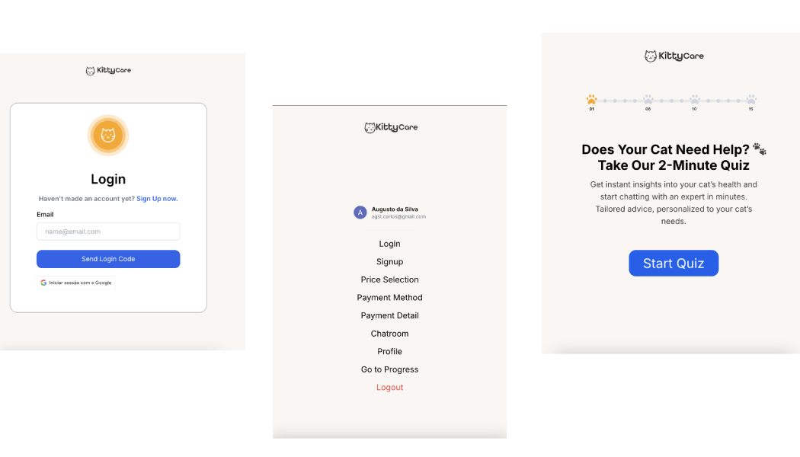

# Kittycare + Google OAuth2 = ❤️‍🔥

<h1 align="center">
  
</h1>

- **API:** [KittyCare API](https://kittycare-api.onrender.com)

## Overview
This guide focuses on the backend implementation of Google OAuth 2.0 authentication using Node.js and Express. The backend handles authentication, token validation, and secure session management using cookies.

## Features
- [x] Implements an OAuth authentication route to handle Google's authentication flow.
- [x] Validates and decodes the Google ID Token received from the frontend.
- [x] Stores authenticated user details in a session or JWT for further authentication.
- [x] Uses httpOnly cookies for secure authentication.
- [x] Implements CORS policies to allow frontend communication.
- [x] Add a logger tool for better debugging. <i>(bonus)</i>

## Security Considerations
- Ensures secure handling of OAuth tokens to prevent unauthorized access.
- Uses httpOnly and Secure cookies for authentication.
- Implements proper error handling and token expiration policies.
- Restricts CORS to only allow specific frontend origins.

## Installation and Setup
### Prerequisites
- Node.js and npm installed
- Google Cloud Console account
- OAuth 2.0 credentials (Client ID & Client Secret)

### Backend Setup
1. Clone the repository:
   ```sh
   git clone <repository_url>
   cd kitticare-API
   ```
2. Install dependencies:
   ```sh
   npm install
   ```
3. Set up environment variables in a `.env` file:
   ```sh
   GOOGLE_OAUTH_CLIENT_ID=<google_client_id>
   GOOGLE_OAUTH_CLIENT_SECRET=<google_client_secret>
   JWT_SECRET=<your_jwt_secret>
   CLIENT_URL=<frontend_url>
   ```
4. Start the server:
   ```sh
   npm run dev
   ```

## API Endpoints
### Google OAuth Login (Validate google token)
**Endpoint:**
```http
POST /api/google-oauth/signin
```
**Description:** Validates and decodes the Google ID Token.

### Logout
**Endpoint:**
```http
POST /api/google-oauth/logout
```
**Description:** Logs out the user and clears authentication cookies.

## Usage
1. The frontend triggers Google OAuth login.
2. The backend validates and processes the authentication.
3. Authenticated users receive the .
4. Users can log out using the logout endpoint.
